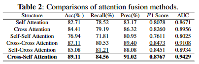
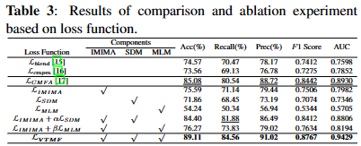
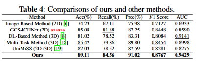

# Joint-Attention Fusion-based 3D Cross-Modal Network \\for ICH Prognosis Classification

## Updates
- (3/11/2023) Version 1.0


## Overview

As depicted in Figure, our method comprises of three components: the Feature Extraction Module, the Joint-Attention Fusion Module, and the Classification Module. These modules represent the three consecutive stages of the entire process.


### Requirements
we use two NVIDIA HGX A100 Tensor Core GPUs for training and evaluation. 
```
- python>=3.9
- CUDA11.1+ + cuDNN
```

## Usages

As you can see, we provide source code and annotation, you could easily use it just after you change according configuration according to your task. Also, each part of our structure is in our source code you can find.

## Experimental Results
#### Modal Ablation Experiment


#### Attention Fusion Structure Experiment


#### Loss Function Experiment



#### Comparison Experiment



